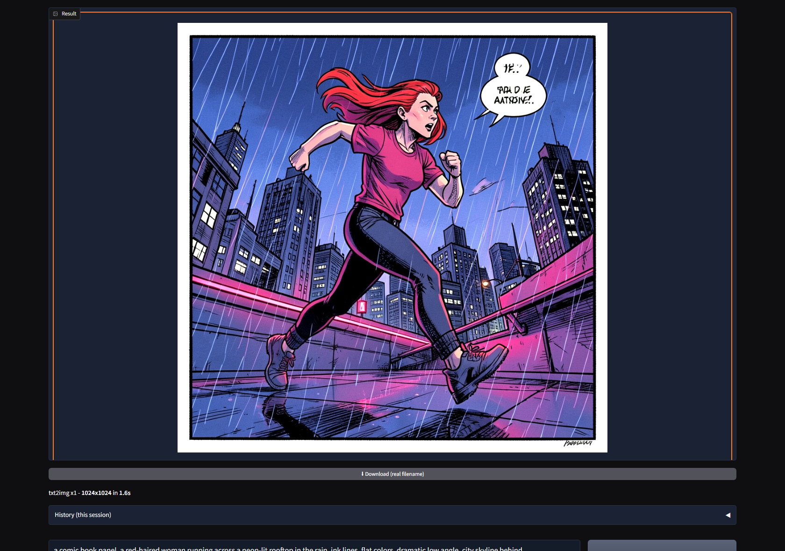
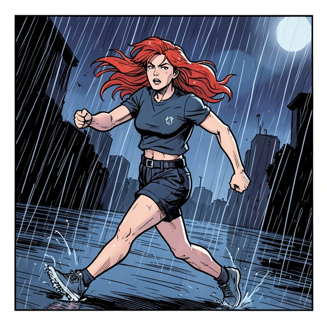
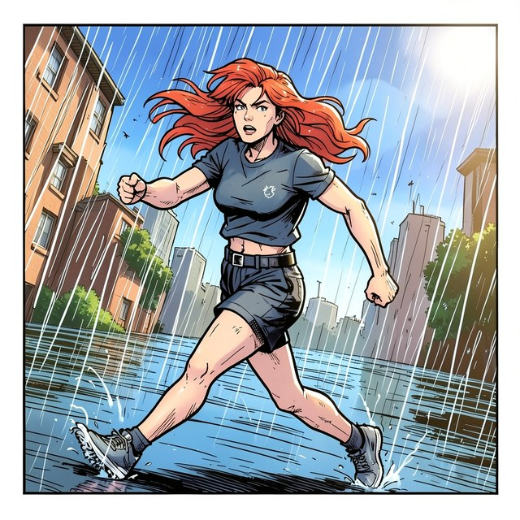
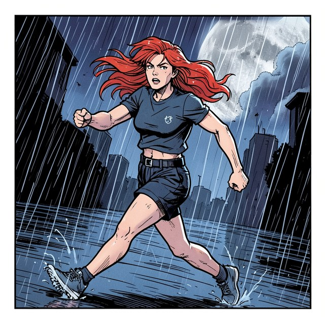

# crispz-klein

> FLUX.2 Klein txt2img + multi-reference editing + upscaler/detailer studio
> (fork of [crispz-qwen-edit](https://github.com/mikecastrodemaria/crispz-qwen-edit),
> itself a Fooocus-style fork of
> [crispz](https://github.com/mikecastrodemaria/crispz)).
> Current version: **1.18.5** — see [CHANGELOG.md](CHANGELOG.md).



*The Text → Image tab, real capture: a 1024×1024 comic panel in **1.6 s** at 4 steps.*

### What it produces

| Generate | Edit (1 reference) | Inpaint |
|---|---|---|
|  |  |  |
| `gen` — 4 steps, 2.0 s | `edit` — *"make it daytime, sunny blue sky"*, 2.8 s | `inpaint` — a moon painted into the masked corner, 2.8 s |

The middle image is the point of this fork: the scene changes completely while the
character stays **pixel-identical** — same face, same pose, same clothes. That is
multi-reference editing running in the *same* pipeline as the generation, with no
second model loaded. All three come from `tests/test_klein_e2e.py`, which you can
re-run yourself.

A standalone **FLUX.2 Klein** creation + editing tool, **100% local**, no ComfyUI /
SwarmUI. Engine: [`black-forest-labs/FLUX.2-klein-4B`](https://huggingface.co/black-forest-labs/FLUX.2-klein-4B)
— 4B parameters, **Apache 2.0**, distilled to **4 steps**.

**Why this fork.** One model covers the whole surface: `Flux2KleinPipeline` does
txt2img *and* multi-reference editing (its `image` argument takes a list of PIL
images), and `Flux2KleinInpaintPipeline` does inpaint *and* img2img. Measured on an
RTX 5090: **14.9 GB of VRAM for everything**, 1024×1024 in **2.0 s**, an edit with one
reference in 3.0 s. crispz-qwen-edit needs two 20B models for the same features.

**Two things to know before using it.** klein-4B is step-wise distilled, so
**negative prompts and the guidance slider have no effect** — verified, renders at
guidance 1.0 / 4.0 / 8.0 are bit-identical (`tests/test_klein_guidance.py`). And the
edit-LoRA catalogue holds exactly one verified preset (`Consistence-Edit`): the
Qwen-Image-Edit presets of the upstream fork are incompatible with FLUX.2. Both are announced honestly in the CLI protocol
(`supports.negative: false`, `edit_loras: []`). Full detail in [FORK.md](FORK.md).

> ⚠️ **4B by default, 9B on request.** `FLUX.2-klein-4B` is Apache 2.0 and is what
> this fork ships with. `FLUX.2-klein-9B` is offered in the same dropdown, but it is
> under the **FLUX Non-Commercial License**, is **gated** on Hugging Face and needs
> **~29 GB of VRAM** (~35 GB of download). Picking it says all of that before the
> first run — setup in
> [Enabling the 9B](#enabling-the-9b--the-hugging-face-part).

On top of crispz's upscaler it adds:

- **Text → Image** (`Flux2KleinPipeline`): generate from a prompt, with an optional
  **Upscale after generate** toggle (under the Generate button) that auto-chains each
  image through the ESRGAN + refine pipeline — no manual step. CLI equivalent:
  `--txt2img --upscale` (see README_CLI.md).
- **Image → Upscale** (the crispz pipeline): Real-ESRGAN + diffusion refine, 4K tiling —
  plus one-click **🎲 Vary (subtle / strong)** (pure img2img re-roll of an input image,
  denoise 0.25 / 0.6, Fooocus-style).
- **Job queue**: `+ Queue` snapshots ALL current settings (incl. model, LoRAs, sampler)
  into a labeled job list; `Run queue` chains them unattended (overnight batches with
  different models/settings). **⏸ Pause finishes the current job then halts**;
  **Stop interrupts it mid-render and the interrupted job stays queued** (re-run
  entirely on resume) — either way no job is ever lost, the queue is saved to
  `cache/queue.json` after every change/job and **restored at startup**. VRAM
  is purged automatically only when the model changes between jobs.
- **X/Y/Z grid**: vary 1–3 parameters (checkpoint, sampler, steps, guidance, denoise,
  ESRGAN model, LoRA file, LoRA weight, Performance preset, **full Prompt (A/B test)**,
  Prompt S/R…) — every combo becomes a queued job and the run ends with an **annotated
  contact sheet** per Z value (X columns × Y rows) saved in the output folder and shown
  in the gallery. The values fields **autosuggest after 3 typed characters** (checkpoints
  and LoRAs validated at startup for those axes; `__wildcards__` on the Prompt axes),
  ↑/↓ + Tab/Enter, comma-separated segments respected.
- **Tag autocomplete** in the prompt/negative fields: suggestions as you type from tag
  CSVs (downloaded once into `tags/`; drop any `.csv` there to add a source) merged with
  your local `__wildcards__`. Dropdown under the caret, ↑/↓ + Tab/Enter, Escape;
  popularity-ranked, indexed (~sub-ms per keystroke).
- **Inpaint / Outpaint** (one tab, 3 modes): **Brush** repaints a painted mask ·
  **Expand sides** outpaints Left/Right/Top/Bottom (+ **Center**) ~30% per side ·
  **Reframe** to a new aspect ratio (**Contain** = keep the whole image and fill the
  borders, **Cover** = crop to fill). All bounded to the model's ~1 MP sweet spot (no
  pixel blow-up), with blurred-edge fill + feathered seams for clean blends, an optional
  **Auto-describe** (local captioner, no Ollama, automatic when the prompt is empty) to
  guide coherent fills, and an optional **Harmonize** pass (light img2img refine over the
  whole result) to unify grain/light and remove the "added zone" look. Steps follow the
  model.
- **Remove Background** (rembg) and **Face Swap** with optional **GFPGAN restore**.
- **🔧 Auto face detailer** (ADetailer-style): tick *Detail faces* under Generate — after
  each render (and upscale), faces are detected and each is re-refined at high resolution
  (enlarged crop → img2img → feathered paste). Denoise slider in Advanced;
  `face_detailer*` config keys.
- **Models**: one **Klein checkpoint** dropdown merging the official base repo
  (`FLUX.2-klein-4B`) with single-file `.safetensors` from a main **and** an optional
  extra folder, a **Transformer override** (diffusers repo/folder), and **multi-LoRA**
  (configurable **1–10 slots** + trigger words). Picking a model also auto-syncs the
  Performance preset. Supported formats: BF16/FP16, **GGUF quants** (stay quantized in
  VRAM), and ComfyUI **FP8 / FP8-scaled / INT8-scaled** builds (dequantized to bf16 at
  load — bf16 memory footprint, the saving is disk/download only; at 4B that is ~8 GB
  of RAM, so unlike the 20B forks a plain single-file is perfectly practical here).
  Still skipped with a clear console message: misfiled LoRAs, SVDQuant/Nunchaku INT4,
  foreign-architecture or sd.cpp-layout GGUFs.
- **Force aspect ratio on Upscale/img2img** (Settings > Aspect ratio): 3-way radio —
  **Off** / **Crop to fit** (centre-crop, Fooocus-style) / **Extend (outpaint)**
  (the missing bands are generated instead, centre kept pixel-for-pixel, seams blended
  by a light pass; config `force_ratio_mode`, `force_ratio_extend_denoise`).
- **Presets (Fooocus-style)** (Settings > ⭐ Presets): **save / load / update / delete**
  presets — a preset bundles prompt, styles, size, steps/CFG, sampler, **base repo** +
  checkpoint, transformer and LoRAs, and **Load** switches the model/LoRAs too. Stored
  in `presets/*.json`.
  A **basic preset is auto-created for every loadable model** (on startup and when you
  Refresh the checkpoint list) if it doesn't already exist yet — named after the model,
  with steps/CFG from its profile. Existing presets are never overwritten; skipped
  models (LoRA/SVDQuant files, foreign GGUFs) get none.
  A single-file checkpoint only swaps the *transformer*, so it is only meaningful under
  the base repo that provides its VAE and text encoder — which is why the preset records
  that base and **Load switches to it** when it differs. The swap downloads nothing by
  itself (the weights come at the next Generate) but it does release the warm model, so
  it is announced. A preset whose checkpoint still cannot load says which base to pick
  and where, before explaining why.
- **Seed**: **♻️ Reuse last seed** (refills the real seed of the previous render) + **Fix
  seed** (no +1 per image). A random `-1` seed is resolved to a concrete value so it is
  actually saved in the metadata.
- **Advanced tab** — **metadata scheme** (`crispz` / **a1111** for **Civitai** upload
  compatibility), **read wildcards in order**, **also save pre-upscale image**, live
  **LoRA-slot count**, and the **Hugging Face token** (gated models).
- **PNG Info**: drop an image into *Input Image* to read its embedded **prompt + params**
  (crispz, **A1111/Civitai**, or ComfyUI) — **✨ Apply all** loads everything in one click
  (prompt, negative, seed, steps, CFG, size, sampler/schedule with A1111-name mapping),
  or send just the prompt / seed.
- **AI provenance (EU AI Act art. 50)**: PNG Info also shows a **Provenance** section —
  **C2PA / Content Credentials** manifests are read automatically (Firefly, ChatGPT,
  Gemini outputs carry them; signature state shown), and **🔍 Check invisible watermark**
  decodes a **TrustMark** watermark on demand (CPU, ~4 s first call then ~0.1 s). Set
  `provenance_watermark: "on"` to embed your own invisible TrustMark id (max 9 ASCII
  chars, `provenance_wm_id`) in every saved image — survives JPEG/WebP re-encoding.
  CLI: `--provenance -i img.png`. Both need `trustmark` / `c2pa-python`
  (`requirements-extra.txt`); absence of marks never means "not AI".
- **Ollama (optional)**: **Describe** (image→prompt), **Improve prompt**, and **Vision
  Mix** (blend several reference images into one prompt). Models unload from VRAM after
  use. Without Ollama, **Describe** uses a local BLIP captioner and **Improve prompt**
  falls back to a local rule-based pass — both work fully offline.
- **Fooocus-style UI**: big contained preview + batch gallery (arrows + fullscreen),
  prompt + Generate + **Stop**, dark theme, Settings (aspect/performance/batch **1–30**),
  **277 styles** (search + hover previews), and a **crop editor** on every image input.
- **Asset Browser** (standalone gallery, new tab): opens **instantly** (indexing +
  thumbnails in the background, shimmer placeholder → real thumbnail); the thumbnail
  cache can live on a **fast disk** (`asset_browser.cache_dir`, e.g. `"D:/cache"`) when
  the output folder is on a slow HDD/NAS — cold-grid loads go from ~1 s to ~3 ms per
  thumbnail; images save into
  **`out/YYYY-MM-DD/`** date subfolders; a **subfolder sidebar** with counts + per-folder
  **hide** + a **Hidden** toggle (persisted), **defaults to today**; **metadata keyword
  search**, per-image copy/delete, NSFW blur; and **Outputs / LoRAs / Models** source tabs
  (models show a Civitai preview if one sits next to the `.safetensors`, else a placeholder
  + trigger words). A **🔎 Fetch from CivitAI** button (per model, in its lightbox) looks the
  model up by **SHA256** and pulls its **preview + trigger words + example images** (saved as
  `<name>.preview.png` + `<name>.civitai.json`), plus the **community consensus settings**
  (median steps/CFG, majority sampler — shown on the model card, and appliable in one click
  via **📊 Apply CivitAI recommended settings** in Models > Checkpoints). The fetch shows **live progress** (spinner +
  bar: real `Hashing… %` when the file must be hashed, then Querying / Downloading) with an
  inline ✅/⚠️ result. **Example images are clickable** → a full-screen viewer shows each
  example **large with its generation prompt** (Copy prompt) and **← / →** to browse. A small
  **🖼️ icon** next to each **LoRA** dropdown and the **Klein checkpoint** dropdown
  (Advanced) opens the Asset Browser **straight to that model's card** (its preview /
  trigger words / examples). A **🔄 Fetch all missing** button (LoRAs / Models tabs)
  enriches the whole folder in one go (same as the standalone `civitai_index.bat` /
  `.sh` — see below); models with a **newer version on CivitAI** get a **⚠ update** badge.
  The badge only counts versions published for the **same base model**:
  a LoRA whose page gains an SDXL or Qwen release is not an update for your
  FLUX.2 copy.
  A **🖼 Rebuild ALL thumbnails (force)** button re-generates every thumbnail of the
  current tab from scratch (parallel, live progress) — for when a thumbnail is corrupt or
  you changed `thumbnail_size`.
  Plus a per-session history in the app. The **Output folder** can point
  anywhere (even another drive); a folder typed into the UI at runtime is auto-authorised,
  so the browser opens without a Gradio *"File not allowed"* error. (In `config.txt`, write
  Windows paths with `/` or `\\` — a single `\` is an illegal JSON escape.)
- **Metadata saved** with every image: PNG text chunk + EXIF (jpg/webp) + `.json`
  sidecar — prompt, negative, seed, steps, guidance, size, model, LoRAs, **applied
  style names**, and the **sampler/schedule**. **Dated, unique filenames** (date +
  tag + seed + size).
- **`config.txt`** for all defaults + the Ollama instruction strings.
- **Reference (Omni)** native multi-image compose — **live, up to 4 references**.
  `Flux2KleinPipeline` takes a list of images, so editing runs in the SAME pipeline
  as txt2img: no second model, no extra VRAM, no extra download. This is the feature
  the upstream forks needed a separate 20B model for.

Tabbed Gradio UI + scriptable CLI + persistent server (`--serve`).

> **CLI cheat sheet:** see **[README_CLI.md](README_CLI.md)** for one-block examples of
> every mode (txt2img, upscale, LoRA, Vision Mix, Remove BG, Reframe, Face Swap, server).

### Launchers (Windows)

| Script | What it does |
|---|---|
| `run.bat` | Standard local launch (127.0.0.1:7860; Gradio takes the next free port if it is busy — the family shares 7860). |
| `xyz_example.bat` | Ready-to-run **X/Y/Z grid** CLI example (`xyz_example.bat "your prompt"`) — 2×2 Steps × Guidance, prints the sheet path. Unix: `xyz_example.sh`. |
| `boot_check.bat` | **Smart boot diagnostic**, any GPU (RTX 50xx/40xx/30xx/20xx…): driver, and — the decisive check — whether the installed torch build actually has kernels for your card's `sm_XX`. That is what catches *"RTX 50xx + non-cu128 torch"* (`WinError 127 torch_cuda.dll`) **before** the app crashes, with the exact fix to run. Then reports VRAM and recommends CPU offload / tiling / resolution for *your* card, checks the diffusers pipelines and lists your real model folders (read from `config.txt`, not hardcoded). **Offers GitHub updates first**: a `[MAJ]` step lists the new commits and asks `O/N` — no answer in 20 s means N, so the app never updates on its own. It is offered only when the update touches none of your local changes (see below). `--no-run` diagnoses without launching; `--no-update` (or `CRISPZ_NO_UPDATE_CHECK=1`) skips the update step. |
| `boot_check_lan.bat` / `boot_check_web.bat` | Same diagnostic, then **LAN** (`0.0.0.0`) or **Cloudflare tunnel**. **Set a login first**: `"auth": "user:password"` in `config.txt` (or `--auth` / `CRISPZ_AUTH`) shows a login page and gates every route — without it, anyone with the URL can generate and browse/delete your images (see `SECURITY.md`). |
| `update.bat` / `update.sh` | **Update after a GitHub pull**: refuses a `git pull` that would touch a file you modified or overwrite a file present outside git (other local changes — `config.txt`, tests, untracked folders — are kept), reinstalls dependencies **only if the requirements file changed**, warns if `torch` was swapped (a transitive resolve can replace a `+cu128` build with a CPU wheel), re-runs the hardware check, verifies the app still imports, and lists **new config keys** added to `config-sample.txt` (your `config.txt` is never overwritten). `--no-pull` / `--force-deps` / `--shared`. |

They set `GRADIO_SERVER_NAME` / `GRADIO_SERVER_PORT` (Gradio reads them) and call `run.bat`.

**Updates at boot.** `boot_check.bat` (and its `_lan` / `_web` wrappers) fetches from
GitHub before the diagnostics (20 s at most: offline, it says so and moves on). With new
commits, it lists up to eight of them and asks `O/N`; **O** runs `update.bat` (pull,
dependencies only if the lock changed, torch and pipeline checks), then the boot goes on
with the new version. It offers an update only when it is safe (`_update_check.py`):

- none of the incoming commits touches a file you modified here — git would refuse;
- none adds a file already present here outside git — git would **overwrite** it without
  a word if it is ignored, and `tests/` is;
- your branch has no local commit missing from GitHub.

Otherwise it names the files in the way, starts the app untouched, and you commit or
stash them before running `update.bat`. Changes elsewhere (`config.txt`, your own tests,
a `wildcards/_backup-*` folder) never block: the pull keeps them.

**Cloudflare (private):** the web launcher reads `cloudflare.local.bat` (your tunnel
name/port) — this file is **gitignored**, never committed. Copy
`cloudflare.local.bat.example` to `cloudflare.local.bat` and fill it in. Leave
`CF_TUNNEL` empty for an ephemeral `*.trycloudflare.com` quick tunnel (no personal
config). Needs `cloudflared` (`winget install --id Cloudflare.cloudflared`).

> Roadmap status: **FaceSwap**, **Inpaint/Outpaint** and **Omni multi-reference**
> all work. The Omni tab needed a separate model on the upstream forks and was kept
> hidden there for lack of one; on FLUX.2 Klein it is native to the base pipeline, so
> it is simply on. ControlNet is next (no FLUX.2 Klein ControlNet published yet). See
> the parent crispz repo for the upscale internals.

## Configuration (`config.txt`)

All defaults and the Ollama prompt strings live in a JSON config. The repo ships a
generic **`config-sample.txt`**; copy it to **`config.txt`** (your local copy,
gitignored) and edit that:

```bash
cp config-sample.txt config.txt    # Windows: copy config-sample.txt config.txt
```

Load order: `config.txt` → `config-sample.txt` → built-in defaults. See
**`config_modification_tutorial.txt`** for every key (filename pattern, Ollama
prompts, the FaceSwap model paths, etc. — the Omni keys of the upstream forks are
gone: klein edits with the base model).

## Styles, Describe & Improve (Ollama)

- **Styles** tab (Advanced): 277 Fooocus/SDXL styles, a **search** box and a
  **thumbnail preview** gallery. Selected styles wrap your prompt and merge their
  negatives. (Sample thumbnails live in `styles/samples/`, local only.)
- **Describe** (Input Image → Describe): caption an image into a prompt using an
  Ollama **vision** model (auto-detected, vision-only list), or a **local captioner**
  (no Ollama needed).
- **Improve prompt**: rewrites the current prompt via the same Ollama model. URL +
  model in Advanced → **Prompt AI**. Tune the instructions in `config.txt`. **Without
  Ollama** it falls back to a local rule-based pass that appends quality tags
  (`improve_local_keywords` in `config.txt`) — instant, no model.
- **Local captioner** (no Ollama): the Describe fallback and the **Auto-describe**
  toggle in Inpaint / Outpaint use a local BLIP model, set by `caption_model` in
  `config.txt` (or **Prompt AI → Caption model**): `blip-large` (default, richer) ·
  `blip-base` (lighter). The model downloads on first use.

## Using a reference image (multi-reference status)

**Available now — img2img.** To guide generation with a reference image, use
**Input Image → Upscale or img2img** (uncheck "ESRGAN upscale" for a pure
img2img refine). One reference image + your prompt.

**Available now — Vision Mix.** Input Image → **Vision Mix** tab: drop up to 4
references, then either *"Vision Mix → prompt"* (fills the prompt) or
*"Vision Mix & Generate"* (one click: blend + generate). A vision model captions
each image and the LLM merges them into ONE prompt (e.g. person + outfit +
setting). Needs Ollama with a real vision model (llava, qwen-vl, …) set in
Advanced → Prompt AI. The merge instruction is `ollama_compose_prompt`, and
`ollama_vision_blocklist` hides models that wrongly claim vision — both in
`config.txt`. Vision Mix blends ideas/style, not exact pixels (that's what the
true Omni model, kept for later, will do).

**Multi-reference compose (person + outfit, etc.)** is **native here**, and this is
the single biggest difference with the rest of the crispz family:

| Fork | Multi-reference | Cost |
|---|---|---|
| crispz-studio (Z-Image) | none — no Omni/Edit model released | — |
| crispz-krea2 (Krea 2) | none — no instruction-edit pipeline exists | — |
| crispz-qwen-edit (Qwen-Image) | yes, via a **separate** Qwen-Image-Edit model | a second ~20B model in RAM/VRAM |
| **crispz-klein (FLUX.2 Klein)** | **yes, in the base pipeline** | **zero — same model, same weights** |

`Flux2KleinPipeline.__call__` takes `image` as `list[PIL] | PIL`, so passing several
references is just another argument. Nothing to configure, nothing to download, no
second model to keep resident.

### Reference (Omni) — always on

The **Reference (Omni)** tab is **enabled out of the box**. Drop 1 to 4 reference
images, write an instruction ("put the character from image 1 in the setting of
image 2", "make it daytime"), Generate. Character identity is preserved while the
scene changes.

The upstream `zimage_omni_model` / `zimage_omni_base` config keys are **gone**:
there is no separate editor to point at. Changing the checkpoint changes the editor
too, because they are the same model. The "Omni / Edit model" field in
Models → Omni is kept for API compatibility with the family and is a no-op.

### What still does not exist for FLUX.2 Klein

| Approach | Status |
|---|---|
| **ControlNet** | no FLUX.2 Klein ControlNet model published yet |
| **IP-Adapter** (what Fooocus uses for image prompts on SDXL) | none — and unnecessary, multi-reference is native |
| **Edit-task LoRAs** | one shipped (`Consistence-Edit`, detail restoration, Apache-2.0). The Qwen-Image-Edit presets of the upstream fork cannot load here and are not advertised; `tools/check_klein_extras.py` watches for new releases |

## Job queue

Queue several generations with different settings and run them unattended.

- **`+ Queue`** (under the prompt area) freezes a complete snapshot: every Generate
  setting **plus the current model state** (checkpoint/transformer, LoRAs + weights,
  sampler/schedule). Jobs are self-contained — you can change the model afterwards, each
  job restores its own. The button shows the pending count.
- **Job queue panel** (accordion): labeled list, select a job, **Up / Down / Remove /
  Clear**, then **`Run queue`** to execute in order (normal progress bar, history and
  file saving as usual).
- **Stop = pause**: the current job is interrupted, remaining jobs stay queued; press
  `Run queue` to resume. A failed job logs `[crispz][queue] …` and the queue continues.
- VRAM purge between jobs happens **only** when the model actually changes (the existing
  model-cache invalidation does the work — zero cost for same-model series).
- Config (`config.txt`): `"job_queue": {"enabled": true}`. Set `false` to remove the
  panel entirely (no components created, zero cost).
- v1 limits: in-memory queue (cleared on page reload), sequential execution.

## X/Y/Z grid

Compare parameter variations side by side on an annotated contact sheet.

1. Open **X/Y/Z grid** (accordion under the Job queue), pick the **X axis** (and
   optionally Y and Z) and type the values, comma-separated — quotes protect commas
   (`"red, bright", blue`). The field's placeholder adapts to the chosen axis, and the
   **`⤵ suggest`** button pre-fills it (app lists for closed choices, calibration values
   for numeric axes) — it never overwrites what you already typed.
2. **Build grid → queue**: every combo becomes a job in the Job queue (validated first:
   numbers cast, closed lists matched case-insensitively — `uni` resolves to `unipc` —
   combo count capped by `max_jobs`).
3. **Run queue**. When the grid has run, one **annotated sheet per Z value** (X in
   columns, Y in rows, 512 px cells, missing cells drawn as placeholders) is saved under
   `<output>/xyz_<timestamp>/` and appended to the result gallery. Pause/resume keeps the
   collected cells, so the final sheet is complete.

Axes: `Checkpoint`, `Sampler`, `Schedule`, `Steps`, `Guidance`, `Seed`, `ESRGAN model`,
`Factor`, `Denoise`, `Tile`, `Refine tile`, `LoRA` (swap the file in LoRA slot 1),
`LoRA + weight` (swap file *and* weight), `LoRA weight` (all active LoRAs),
`Performance` (applies the preset), `Prompt S/R` (first value = search term, then its
replacements; the term must exist in the prompt).

**Comparing LoRA epochs.** The `LoRA` axis swaps the *file* in slot 1 while keeping the
weight you set in the Models panel — what you want when the same LoRA was trained over
several epochs, or re-uploaded as several CivitAI versions. Hit **`⤵ suggest`** to drop
the full list of available LoRAs into the field, then delete the ones you don't want to
compare. Names match like every other closed list: any unambiguous fragment works, so
`e000020` is enough — an ambiguous or unknown one is rejected at **Build** time, not
mid-series. `None` is a valid value for a LoRA-free control cell, and other active slots
are left untouched. `LoRA + weight` varies both at once, written `name:weight`
(`ollie_e10:0.6, ollie_e20:0.9`) — the suggest button pre-fills each entry with the
current weight, so you only edit the numbers. Cell labels show the base name without
extension, trimmed from the *left* so the `_e000020` suffix that tells your epochs apart
stays visible.

Config (`config.txt`): `"xyz_grid": {"enabled": true, "max_jobs": 100, "thumb": 512}` —
requires `job_queue`; `enabled=false` removes the panel entirely.

Also available from the CLI: `--txt2img --xyz "Steps=4,8,12" --xyz "Guidance=0, 3.5"`
(see README_CLI.md) — same axes and validation, Ctrl+C assembles a partial sheet.

## Tag autocomplete (prompt fields)

Suggestions appear under the caret while typing in the **prompt** and **negative**
fields (from 2 typed characters in the current comma-delimited token).

- **Keys**: ↑/↓ navigate · **Tab / Enter** insert · **Escape** close · click works too.
  Inserted tags get underscores replaced by spaces; `__wildcard__` entries are kept
  verbatim.
- **Sources**: the CSVs in `tag_autocomplete.sources` are downloaded **once** into
  `tags/` (atomic, with console progress). Drop any extra `.csv` in `tags/` to add a
  source — rich format `name,category,count,"alias1,alias2"` or one word per line.
  Your **wildcards** are merged in as `__name__` entries with top priority. Aliases
  match too (shown alongside the tag).
- **Performance**: the index is built once in the browser (popularity sort, dedup,
  2-char prefix buckets, early exit at `max_results`). Timings are logged in the
  browser console: `[tagac] ready in N ms` and a rolling per-keystroke average.
- Config (`config.txt`):
  `"tag_autocomplete": {"enabled": true, "max_results": 8, "sources": [<urls>]}` —
  `enabled=false` downloads nothing and injects no script (zero cost).

## Inpaint / Outpaint (Advanced tab)

One tab with three modes. The image editor, prompt, **Steps** (from the model
Performance) and **Strength** are shared across modes:

- **Brush (inpaint)** — paint a mask over the area to change, describe the result in the
  prompt, run. Brush size is set from the editor toolbar (click the brush icon).
- **Expand sides (outpaint)** — check **Left / Right / Top / Bottom** (or **Center** for
  all four) to grow the canvas ~30% per side; the model fills the new borders.
- **Reframe (ratio)** — pick a target aspect ratio + **Contain** (keep the whole image
  and fill the borders) or **Cover** (crop to fill).

All modes are bounded to the model's **~1 MP sweet spot** (no pixel blow-up). Border
fills use a **blurred-edge init + feathered seams** so new content matches the original's
colors, and the unmasked area keeps its full resolution.

Tips for clean outpaint/reframe:

- **Describe the result** in the prompt (the full outfit/scene). **Auto-describe** runs
  automatically when the prompt is empty (local BLIP captioner, no Ollama) to keep the
  fill coherent with the center — or check it to also prepend a description to your prompt.
- **Strength** ~0.65–0.8 blends best (keeps the edge colors); ~1.0 adds more new detail
  but a more visible transition.
- **Harmonize** (checkbox) runs a light final img2img refine over the whole result to
  unify grain/light and remove any remaining "added zone" look.
- The local caption model is set in **Prompt AI → Caption model** (`blip-large` /
  `blip-base`).

## Face Swap — post-process  *(Phase 3, optional)*

Input Image → **Face Swap** tab: a source face + “Apply face swap to result”.
Works on any mode (txt2img / img2img / omni). The installer sets up the deps by
default (`insightface` + `onnxruntime-gpu`); skip with `install.bat --no-faceswap`,
or install manually:

```bash
.venv/Scripts/python -m pip install -r requirements-faceswap.txt
```

and an **inswapper model**: drop `inswapper_128.onnx` in the `faceswap/` folder
(auto-detected), or set `faceswap_model_path` / `faceswap_model_url` in `config.txt`.
The face-detection model (buffalo_l) downloads automatically on first use. If the
dep/model is missing, the run still succeeds and the report says `faceswap skipped`.

> The inswapper weights are not redistributed here (license). Get them from a
> Hugging Face mirror, e.g. `ezioruan/inswapper_128.onnx`. Local model files
> (`faceswap/`, `*.onnx`) are gitignored.

### Blending quality

inswapper produces a **128 px** face and insightface pastes it back through a plain
**rectangle**. That rectangle is blind to what is in front of the face: a hand, food,
a microphone or a strand of hair falling over the mouth gets painted over by the
generated pixels. crispz-klein therefore does its own compositing, with four passes
you can toggle under *Face Swap → Blending quality* (all on by default):

| Setting | What it fixes | Model (auto-downloaded) |
|---|---|---|
| **Occlusion mask** | objects *in front of* the face are preserved | `dfl_xseg.onnx` |
| **Face-region mask** | no bleed onto hair, neck, clothes, background | `bisenet_resnet_34.onnx` |
| **Colour match** | skin tone / exposure differences between source and target | — |
| **Restore** | the soft 128 px swap, re-synthesised at 512 | `codeformer.onnx` or `gfpgan_1.4.onnx` |

The occlusion mask is the important one: without it, any shot where something touches
the face comes out broken around the mouth. Each model is fetched once into `faceswap/`
and can be pointed elsewhere via `faceswap_occluder_path` / `faceswap_parser_path` /
`faceswap_codeformer_path`. If one is unavailable the pass is skipped with a log line —
the swap still runs. Total cost is about **90 ms per face** on GPU.

The enhancer is `codeformer` by default (`faceswap_restore_model`); its
`faceswap_restore_fidelity` goes from 0 (maximum detail, more generative) to 1 (maximum
fidelity to the swapped pixels) — 0.5–0.7 suits a 128 px swap. GFPGAN ignores it.

> **Not the same thing as Fooocus's “FaceSwap”.** Fooocus conditions the *diffusion*
> on a face embedding (IP-Adapter face), so the whole image is generated coherently and
> occlusion can never break — but the identity is only approximate, and it cannot be
> applied to an existing image. The swap here transfers the *exact* face as a
> post-process. Different trade-offs, not a better/worse pair.

## Text -> Image

```bash
# Generate only
python app.py --txt2img --prompt "a serene mountain lake, cinematic" \
    --gen-width 1024 --gen-height 1024 --gen-steps 8 --seed 42 \
    --save-mode local --output-dir out

# Generate then upscale (ESRGAN + diffusion refine)
python app.py --txt2img --prompt "portrait of an old fisherman" --upscale \
    --factor 2 --denoise 0.30 -m 4x-ClearRealityV1_Soft.safetensors \
    --save-mode local --output-dir out
```

In the UI, use the **Text -> Image** tab. FLUX.2 Klein is distilled: **4 steps**, and
the guidance value is irrelevant (see below).

## Civitai / single-file FLUX.2 checkpoint

```bash
# Pass a .safetensors directly as the model (treated as the transformer)
python app.py --txt2img --prompt "..." \
    --klein-model "D:/models/flux2_klein_civitai.safetensors"

# Or keep an HF/diffusers base and override only the transformer
python app.py --klein-transformer "D:/models/flux2_klein_civitai.safetensors" ...
```

The single-file is loaded as the **transformer**; the **VAE + the Qwen3 text encoder**
still come from the base repo. **BF16/FP16, GGUF (kept quantized in VRAM) and ComfyUI
FP8/INT8 "scaled" builds (dequantized to bf16 at load) are all supported**; only
misfiled LoRAs, SVDQuant/Nunchaku INT4 and foreign-architecture files are refused.

### Guidance: there isn't any

FLUX.2 Klein is **step-wise distilled**. diffusers drops `guidance_scale` for such
models, and the `Flux2Klein*` pipelines expose **no `negative_prompt` at all** (only
`negative_prompt_embeds`, which is useless without CFG).

This is measured, not assumed — `tests/test_klein_guidance.py` renders the same seed
at guidance 1.0 / 4.0 / 8.0 and the images come back **bit-identical** (MAE 0.0000):

```bash
.venv/Scripts/python tests/test_klein_guidance.py
```

| Control | Effect on klein |
|---|---|
| **CFG guidance** slider / `--guidance` | none — kept for API compatibility |
| **Negative prompt** | none — the pipeline has no such argument |
| **Steps** | the one that matters: **4** (8 buys very little) |

The CLI protocol says so honestly: `caps` reports `supports.negative: false`, and a
spec carrying `negative` or `guidance` comes back with a `warnings` entry rather than
silently pretending. Sampler/schedule still apply: CLI `--sampler`, `--schedule`.

## Switching models in the UI (Advanced → Models)

The **Klein checkpoint** dropdown is the single place to switch model. It merges,
in one list:

- the official base repo **`black-forest-labs/FLUX.2-klein-4B`** (pulled from Hugging
  Face on first use), then
- every single-file `.safetensors` found in your **Checkpoints folder** **and** the
  optional **Extra checkpoints folder** (both merged into the same list).

What each choice does:

| You pick… | Effect | Performance preset (auto) |
|---|---|---|
| **black-forest-labs/FLUX.2-klein-4B** | full base repo, the default (Apache 2.0, distilled) | from the model profile |
| **black-forest-labs/FLUX.2-klein-9B** | full base repo — bigger, **non-commercial**, gated, ~29 GB VRAM | from the model profile |
| a local `.safetensors` | used as the **transformer** (VAE + Qwen3 encoder kept from the current base repo) | from the model profile |

Picking a **base repo** swaps everything — transformer, VAE and Qwen3 text encoder —
so it also changes which single-file checkpoints can load: a 9B build does not fit a
4B pipeline and vice versa. The dropdown is rebuilt on the spot, the missing model
presets are created, and the choice is written to `preferences.json` so the next
launch starts on it. A checkpoint the list refuses is **refused on selection**, with
the reason, instead of failing mid-run on `expected shape [18432, 3072], but got
[24576, 4096]`.

### Enabling the 9B — the Hugging Face part

The 4B is public: nothing to do. The **9B is gated**, so the Hub will refuse it
until two things line up — and they are two *different* things, which is where the
time gets lost.

**1. Accept the licence**, at
<https://huggingface.co/black-forest-labs/FLUX.2-klein-9B> (the button under the
title). It is `gated: auto` — no queue, no human review, it takes effect at once.
Accept it on the **exact** repo: `-9b-fp8`, `-9b-kv`, `-base-9B` and the rest each
have their own gate, and accepting one does not open another.

**2. Give the app a token from that same account.** Either:

```bat
huggingface-cli login          REM read token, picked up without restarting the app
```

or `"hf_token": "hf_..."` in `config.txt` (read at import → restart), or the field
in **Advanced → Models** (applied immediately and persisted).

> **The trap: the account that accepted the licence must be the account the token
> belongs to.** A token that works everywhere else — it pulls the 4B fine — still
> gets a `403 GatedRepoError` on the 9B if the licence was accepted while your
> browser was logged in as someone else. The error looks identical to "licence not
> accepted", so check who the app actually is:
>
> ```bat
> huggingface-cli whoami
> ```

If the Hub refuses, the app does not hand you a `huggingface_hub` traceback: it
says the repo is gated, links the page to accept, and tells you whether a token is
being sent at all — so you know which of the two halves is missing.

**Then pick the 9B in the dropdown.** Selecting a base repo also re-reads its
dimension, so a licence accepted *after* a failed attempt takes effect on the next
selection rather than at the next restart.

**What lands on disk:** ~35 GB — transformer 18.2 GB + Qwen3 8B text encoder
16.4 GB + VAE. The repo itself totals 52.9 GB, but the extra 18.2 GB is
`flux-2-klein-9b.safetensors` at the root, the single-file build, which
`from_pretrained` does not fetch.

**Making the 9B usable on a 32 GB card.** The full bf16 base — transformer 18.2 GB +
Qwen3-8B encoder 15.3 GB — does not fit in 31.8 GB, so the offload is forced to `model`.
Re-measured 2026-09-09 on an RTX 5090, 1024x1024, 4 steps, same prompt, encoder trimmed:

| | load | first image | steady state | peak VRAM |
|---|---|---|---|---|
| bf16 base | ~25 s | ~35 s | **6.4–9.1 s** | 17.7 GB |
| GGUF override (Q8_0, 9.1 GB) | ~83 s | ~19 s | **6.0 s** | 14.4 GB |

An earlier edition of this page said **50 s** for the bf16 base and sold GGUF as the
cure at 10.9 s. Both numbers are gone: 50 s is what the **first** image costs today, not
what every image costs — the figure conflated loading with running, the exact mistake
`bench_models.bat` exists to prevent. Two consecutive images vary by as much as the two
configurations differ from each other, so do not read a 13 % gap as a verdict.

GGUF still earns its place, just not where the old text claimed: **3.3 GB less peak
VRAM** and a first image roughly twice as quick. It costs 83 s to load, so it pays on a
long session with one model, not on a grid that switches checkpoints.

`.safetensors` fp8/int8 builds do **not** help here: they are the ComfyUI "scaled"
format, and the loader dequantizes them to bf16 — 8.8 GB on disk, ~18 GB in VRAM again.
They save disk, not memory. Only GGUF stays quantized at run time.

**Pre-loading the dequant, once.** That conversion is not free: the first load of an
fp8/int8 checkpoint reads and rewrites the whole file — minutes, in the middle of a
session. The bf16 result lands in `cache/dequant`, and the next loads of that same
file become a plain single-file read (seconds). `rebuild_cache.bat --list` shows what
would be converted, what each entry weighs once expanded (~17 GB for a klein-9B
transformer, ~7 GB for a 4B) and whether `dequant_cache_max_gb` covers the total —
if it does not, the last conversions evict the first ones and the cache buys nothing.
Without `--list` it converts, and it resumes: anything already cached is skipped in a
second. Both variants are pre-filled whatever base you currently run, so switching
4B ↔ 9B never repays the conversion. Deleting `cache/dequant` is always safe.

### LyCORIS LoKr

A LoKr is not a LoRA: its update is a Kronecker product, `dW = w1 (x) w2`, and
neither peft nor diffusers can apply one — there is not a single occurrence of
`lokr` in `loaders/lora_conversion_utils.py`. It is supported here by **merging it
into the weights** at load: drop it in the LoRA folder and pick it in *Models >
LoRA* like any other.

Why a merge rather than an adapter: on FLUX.2 the q/k/v projection is **fused** in the
checkpoint (one `[3d, d]` matrix) and **split** in diffusers (three `[d, d]`). A
Kronecker product does not cut into three — on SNOFS, `w1` is `[4, 4]` and `w2`
`[3072, 1024]`, so its blocks are 3072 rows tall where the split falls at 4096. The
materialized delta cuts like any other matrix. Key conversion goes through diffusers'
own Flux2 converter, the one `from_single_file` uses, so it cannot drift from how the
model itself is loaded — and anything that fails to find its target is reported, never
dropped quietly.

The scale follows LyCORIS: no scalar at all when `w1` and `w2` are full (there is no
rank), `alpha / rank` otherwise. ai-toolkit writes `alpha = lora_dim` in the full case
(1e10 on SNOFS), so both conventions agree on 1.0.

**The trade-off, stated plainly:** a merge is not an adapter. Changing which LoKr is
selected, or its weight, reloads the transformer — the app detects it and says so —
where a PEFT LoRA is swapped in place. LoHa is *not* supported and is refused by name.

**A local 9B `.safetensors` does not spare you the gated repo either.** A single-file
checkpoint only replaces the *transformer*; the VAE, the text encoder and the
architecture config still come from the gated base repo. An fp8 or GGUF 9B build
saves VRAM, not the licence.

Set `klein_base_repos` to the 4B alone in `config.txt` if you never want the 9B
offered in the first place.

Switching the dropdown automatically syncs **steps, guidance and the Performance
radio**. The change is applied on the next **Generate**.

**Switching between two `.safetensors` (or clearing an override) reloads only the
transformer** — the VAE, the Qwen3 text encoder and the tokenizer stay in VRAM, so it
takes seconds instead of a full reload. Only picking a **different base repo** reloads
everything (its VAE/encoder genuinely differ). Same for LoRAs: they are hot-swapped, and
changing just a weight is instant.

Steps:

1. **Models → Checkpoints folder** (and, if you keep models elsewhere, **Extra
   checkpoints folder**) → **Refresh**. Both folders feed the single dropdown.
2. Pick an entry in **Klein checkpoint** — the base repo or a local file.
3. **Generate** → it loads with your selection.

### Community full-repo models

Some community models ship as a **full diffusers repo** but with an **incomplete
tokenizer** (only `tokenizer.json`), so loading them as the **base** fails. Load
just their **transformer** instead and keep the base components:

1. **Models → "Transformer override (HF repo / diffusers folder)"** = the repo →
   **Apply**.
2. Keep the **Klein checkpoint** dropdown on `black-forest-labs/FLUX.2-klein-4B`
   (provides VAE + Qwen3 encoder + tokenizer).
3. **Generate** (downloads the transformer once, ~7 GB).

CLI equivalent: `--klein-transformer <repo-or-folder>`.

> FLUX.2 Klein is recent, so the community fine-tune scene is still thin. The
> loading path is the one inherited from the Qwen fork and it is **tested** — a
> 7.2 GB single-file `.safetensors` loads and renders — but expect few models to
> point it at for now.

**Gotchas**

- **BF16/FP16, GGUF and ComfyUI FP8/INT8 "scaled" checkpoints all load** (GGUF stays
  quantized in VRAM; FP8/INT8 are dequantized to bf16 in RAM — at 4B that is ~8 GB,
  not the ~38 GB the 20B forks had to warn about).
  Only misfiled **LoRAs**, **SVDQuant/Nunchaku INT4** and foreign-architecture files are
  auto-hidden from the list (a `checkpoint skipped (...)` line is logged). The
  architecture guard looks for the real FLUX.2 key markers
  (`single_transformer_blocks`, `x_embedder`, `context_embedder`, …).
- Don't bother tuning guidance for a checkpoint — it is inert (see above). Steps are
  the only knob: 4.
- Verify what loaded with `run.bat --debug`:
  `[crispz] loading Klein transformer (single-file): …`.

**Persist the folders** (so you don't re-type them) in `config.txt`:

```json
"checkpoints_dir": "C:\\path\\to\\models\\Stable-diffusion\\FLUX2",
"checkpoints_extra_dir": "",
"loras_dir": "C:\\path\\to\\models\\Lora"
```

### Text encoder (swap)

**Models → Checkpoints → Text encoder** replaces the base repo's own Qwen3 text encoder,
for instance with an *abliterated* Qwen3 of the same size. Only the encoder changes: the
tokenizer, the VAE and the transformer stay the base repo's, and the encoder is trimmed
like the stock one.

**Which encoder fits.** It must have the shape of the base repo's own encoder:

| Base (and its checkpoints) | Encoder it takes |
|---|---|
| FLUX.2-klein-4B | a Qwen3-4B: `qwen3`, hidden size 2560, 36 layers |
| FLUX.2-klein-9B | a Qwen3-8B: `qwen3`, hidden size 4096, 36 layers |

Anything else is refused **before it loads**, with the reason — e.g. *hidden size 2560,
and FLUX.2-klein-9B's encoder is 4096 wide … this is an encoder for FLUX.2-klein-4B*.
GGUF files (made for ComfyUI / llama.cpp) and single `.safetensors` files are refused
too: the app needs the transformers **folder** (`config.json` + weights). The 4B ships
the public `Qwen/Qwen3-4B`, bit for bit the encoder Z-Image uses, so abliterations of
Qwen3-4B fit it.

**Downloading one.** An encoder from Hugging Face goes into the HF cache
(`%USERPROFILE%\.cache\huggingface\hub`), where the picker finds it. From the app folder,
with its venv (`import cz_core` makes the download use the app's own Hugging Face token):

```bat
.venv\Scripts\python -c "import cz_core; from huggingface_hub import snapshot_download; print(snapshot_download('huihui-ai/Huihui-Qwen3-4B-abliterated-v2'))"
```

When the encoder sits in a **sub-folder** of its repo, next to GGUF files you do not need,
fetch that folder only:

```bat
.venv\Scripts\python -c "import cz_core; from huggingface_hub import snapshot_download; print(snapshot_download('ponpoke/flux2-klein-4b-uncensored-text-encoder', allow_patterns=['flux2-klein-4b-uncensored-text-encoder/*']))"
```

A **gated** repo answers `403 … not in the authorized list` until you accept its terms on
its Hugging Face page, **with the account of the token the app uses** (`hf_token` in
`config.txt` / `preferences.json`, or `HF_TOKEN`): accepting with another account changes
nothing. A local folder works too: put it under `text_encoders\<name>\` next to your
checkpoints folder or its parent, or point `text_encoders_dir` at your own folder.

**Picking it.** The list offers *Default (base repo's own)*, the folders found, and the
encoders of the HF cache that fit the current base, marked *(HF cache)*. Pick one, or paste
a folder path or a Hugging Face id (`owner/repo`, or `owner/repo/subfolder`) and press
Enter. The status line confirms, and the model reloads on the next run with the prompt
cache cleared. Encoders of the cache that do **not** fit the current base are named under
the list with the reason (typically Qwen3-4B encoders while the 9B is selected: switch
to the 4B to use them). The list follows a model change; **Refresh encoders** rescans
after a download.

**What is recorded.** An image made with a replacement encoder carries `text_encoder` in
its metadata (folder name or Hugging Face id, never a local path) and `Text encoder:` in
its A1111 parameters; an encoder asked for but set aside at load time is recorded as
`text_encoder_not_applied`. The queue keeps each job's encoder, and *Default* survives a
restart. Config: `text_encoder`, `text_encoders_dir`; env `KLEIN_TEXT_ENCODER`.

> Measured on the 4B (4 steps, seed 12345, the three bench prompts), similarity to the
> stock encoder's image on portrait / scene / chalkboard: `huihui-ai/Huihui-Qwen3-4B-abliterated-v2`
> 0.94 / 0.75 / 0.85, chalkboard spelt right; `ponpoke/flux2-klein-4b-uncensored-text-encoder`
> 0.87 / 0.61 / 0.41, two misspelt words. One seed: an indication, not a ranking. An
> encoder cannot teach the transformer a concept it never learnt.

### LoRA (up to 3, combinable)

**Models → LoRA**: set the folder → **Refresh** → pick **up to 3 LoRAs**, each with
its own **weight** (range **`-2..2`**, configurable via `lora_weight_min` /
`lora_weight_max`). A **negative weight inverts the LoRA's effect** — a "skinny slider"
LoRA at `-1` pushes the other way; `0` disables it. They are combined (`set_adapters`) on
the transformer (shared
by txt2img/img2img) and applied on the next run **without reloading the model** —
changing a weight is instant, swapping LoRA files takes ~1 s. Selecting LoRAs auto-fills their
merged **keywords / trigger words** (read from the file metadata); **Add to prompt**
appends them.

### Edit LoRA presets (Qwen-Image-Edit task LoRAs)

The edit pipe (Reference (Omni) tab, protocol op `edit`) has its **own** LoRA set:
the slots above only reach the txt2img/img2img transformer. Under the reference
images, the **Edit LoRA** dropdown lists the 19 task LoRAs of
[Qwen-Image-Edit-2511-LoRAs-Fast-Lazy-Load](https://github.com/PRITHIVSAKTHIUR/Qwen-Image-Edit-2511-LoRAs-Fast-Lazy-Load)
(Photo-to-Anime, Any-Light, Light-Migration, Upscaler 2K, Multiple-Angles,
Style-Transfer, Polaroid, Pixar-3D, noir comic, Studio-DeLight...). `⬇` = fetched
from Hugging Face on first selection into `<loras_dir>/_hf-edit/<adapter>.safetensors`
(then it is an ordinary LoRA file), `✓` = already on disk. They have **no trigger
word**: the instruction is the prompt (**Use example prompt** fills the upstream
example). Presets marked "2 images" want the image to edit in **Ref 1** and the
reference (light, style) in **Ref 2**. The **Edit LoRAs** checkbox in Models → LoRA
switches the whole edit set on/off without losing the selection. `config.txt`
`edit_loras` adds/replaces/removes presets, `edit_loras_dir` moves the folder.

**Edit speed** (next dropdown): `Lightning 4 steps` / `Lightning 8 steps` stack the
lightx2v Lightning edit LoRA (2509 or 2511, chosen from the edit model name; taken
from your LoRA folders when already there, downloaded otherwise) and force N steps
with CFG off. `Auto (model profile)` is for an already-distilled edit model such as
a Rapid-AIO single file set as `zimage_omni_model` (`.gguf` or `.safetensors`, the
FP8 builds are dequantized like the base): steps/guidance come from
`model_profiles` (`aio` = 4 steps). `Off` keeps the Settings values. Initial value:
`config.txt` `edit_fast`.

**Extra LoRA folders**: `loras_extra_dirs` (config, or the textbox under the LoRA
folder, or `--loras-extra-dir`) merges other libraries, e.g. a shared Civitai
folder, into every LoRA list. On a duplicate file name the main folder wins.

## Disabling the upscale (pure txt2img / pure img2img)

- **txt2img only** (no upscale): the default. Don't pass `--upscale` (CLI), or leave
  the "Upscale after generation" checkbox off (UI).
- **img2img only** (refine without ESRGAN enlargement): `--no-esrgan` (CLI), or
  uncheck **"ESRGAN upscale"** in the Image -> Upscale tab. The diffusion refine runs
  on the input at its native size.
- **ESRGAN only** (fast upscale, skip the slow refine): `--no-refine` (CLI, shortcut
  for `--denoise 0`), or uncheck **"Refine (img2img)"** in the Image -> Upscale tab.
  The two stages are independent toggles: the diffusion refine runs at the *upscaled*
  resolution, so it is the slow part — turn it off when you just want a clean enlarge.

```bash
# img2img only: diffusion refine on the input, no enlargement
python app.py --cli -i in.png --no-esrgan --denoise 0.30 --save-mode local --output-dir out

# ESRGAN only: fast upscale, no diffusion refine
python app.py --cli -i in.png -m 4x-ClearRealityV1_Soft.safetensors --no-refine \
    --factor 2 --save-mode local --output-dir out
```

---

## Installation

### Requirements

- Python 3.10+
- PyTorch **already installed** with your CUDA build (the project targets
  PyTorch 2.7+ / CUDA 12.8). **NEVER reinstall torch** from this project; it
  aligns with your existing environment.
- An NVIDIA GPU with >= 8 GB VRAM is recommended. RTX 5090 tested in native BF16,
  whole-image up to 2048px without trouble.

### Provided install scripts

```bash
# Linux / macOS / WSL
./install.sh
./run.sh           # Gradio UI + hardware detection
./cli.sh           # interactive CLI with preferences

# Windows
install.bat
run.bat
cli.bat
```

The install scripts:
- find a base Python that already has PyTorch (never touch torch),
- by default create a **`.venv` virtual environment with
  `--system-site-packages`**: it **inherits your system torch/CUDA** (no torch
  reinstall) while **isolating crispz's own deps** (diffusers, gradio, spandrel)
  from your global Python,
- automatically uninstall a broken `xformers` (built for the wrong torch
  version -> DLL load error when diffusers loads),
- install the other deps from `requirements.txt`,
- verify that `Flux2KleinInpaintPipeline` loads,
- create the `upscale_models/` folder.

`run.sh` / `cli.sh` (and the `.bat`) automatically use `.venv` if it exists.

### venv or not: the `--no-venv` flag

The venv is the default (keeps your global Python clean). To install/run directly
on the current interpreter instead (the old behavior), pass `--no-venv` (or
`--system`) to any script:

```bash
./install.sh --no-venv      # install on the current Python
./run.sh --no-venv          # run on the current Python
```

```bat
install.bat --no-venv
run.bat --no-venv
```

If venv creation fails, the scripts fall back to the current Python automatically.

Equivalent manual install (no venv):

```bash
pip install -r requirements.txt
```

### Known environment pitfalls

- **Incompatible `xformers`.** If an `xformers` version is installed but built
  for a different torch (e.g. `xformers` for torch 2.9 while you have torch 2.8),
  diffusers crashes with `DLL load failed while importing _C` when loading the
  VAE. Fix: `pip uninstall xformers`. The native SDPA in torch 2.7+ is enough.
- **`transformers` too old.** FLUX.2 Klein uses a **Qwen3 text encoder**
  (`Qwen3ForCausalLM`), available since transformers >= 4.51. The requirements pin
  this lower bound; below it the pipeline fails to load the encoder.
- **diffusers from git.** The FLUX.2 pipelines (`Flux2KleinPipeline`,
  `Flux2KleinInpaintPipeline`) only exist in diffusers from source, hence the pinned
  `git+...` commit in requirements. Install/Update verify the import explicitly.
- **Gradio pinned `<6`.** Gradio 6's Brotli middleware has an h11 bug that spams
  `Too little data for declared Content-Length` in the console when a response is
  interrupted (non-fatal, but noisy). Requirements pin `gradio<6` to avoid it.

---

## Configurable paths (ESRGAN_DIR + the Klein model)

Two paths are configurable, persisted in `preferences.json`. Resolution order on
each launch:

1. Environment variable (`ESRGAN_DIR`, `KLEIN_MODEL`)
2. `preferences.json` at the project root
3. Default: `./upscale_models` for ESRGAN, `black-forest-labs/FLUX.2-klein-4B` for the model

Three ways to change them:

- **Gradio UI**: **Advanced → Models** tab. Pick the model in the **Klein
  checkpoint** dropdown (it reloads on next Generate), set the **Checkpoints /
  Extra checkpoints / ESRGAN** folders, then **Refresh ESRGAN** or **Save paths**
  (writes `preferences.json`).
- **CLI**: `--esrgan-dir <path>`, `--klein-model <repo_or_path>`, `--save-paths`
  to persist (with or without `-i`).
- **Interactive CLI** (`cli.sh` / `cli.bat`): first prompt = ESRGAN folder +
  Klein model. Saved to `preferences.json` if you choose to keep them.

`klein_model` accepts either an HF repo (e.g. `black-forest-labs/FLUX.2-klein-4B`) or a
local path to an already-downloaded `diffusers` folder.

## ESRGAN models

Drop at least one `.pth` or `.safetensors` into `./upscale_models`, or point
`ESRGAN_DIR` (env or prefs) at an existing folder.

A few useful picks:
- `RealESRGAN_x4plus.pth` (general)
- `4x-UltraSharp.pth` (sharp, versatile)
- `4x-ClearRealityV1_Soft.safetensors` (soft, good on portraits/scenes)
- `4xFaceUpDAT.pth` (portraits/faces)

`spandrel` detects the architecture and the scale (x2 / x4) automatically.

---

## The model (first run)

No file to provide: on first launch, `diffusers` fetches the FLUX.2 Klein transformer,
the VAE and the Qwen3-4B text encoder from Hugging Face, then everything is cached
locally. Subsequent runs are offline.

**Loading progress** — because the first load downloads several GB and then reads them
into VRAM, it can take minutes. The terminal shows a live one-line status
(`[crispz][load] FLUX.2 Klein base... 9s | 14.9 GB in VRAM`, or `... (downloading / reading,
first run only)` before allocation starts) and the UI progress bar advances with it.
Turn it off or tune it in `config.txt`:
`"load_progress": {"enabled": true, "target_vram_gb": 14.0, "heartbeat_s": 2.0}`
(`enabled: false` loads directly with no monitor thread).

---

## Running

### 1) Gradio UI (default)

```bash
python app.py
```

UI at http://127.0.0.1:7860. It includes:

- **Before/after slider** (`gradio_imageslider`) that overlays source and result
  with a mouse cursor. Falls back to two side-by-side images if the component is
  not installed.
- **Timing report** under the image: ESRGAN, diffusion refine, total, source path,
  save path.
- **"Save" section** with the same modes as the CLI.
- **Batch mode**: if you fill in "OR source folder", the uploaded image is ignored
  and the app processes the whole folder.

### 2) Scriptable CLI

```bash
# Single image, explicit settings
python app.py --cli -i my_image.jpg \
    --save-mode local --output-dir out --output-format png \
    -m 4x-ClearRealityV1_Soft.safetensors \
    --factor 2 --denoise 0.30 --steps 12 --tile 760 --overlap 32

# Batch over a whole folder
python app.py --cli -i ./my_images --save-mode local --output-dir out --output-format webp

# Save next to each source ("alongside" mode)
python app.py --cli -i ./my_images --save-mode alongside --output-format jpg

# Display only (no file written), just the timing on stdout
python app.py --cli -i my_image.jpg --save-mode display --denoise 0

# With a TSV log to track timings
python app.py --cli -i ./my_images --save-mode local --time-log runs.tsv
```

### 3) Interactive CLI with preferences

```bash
./cli.sh   # or cli.bat on Windows
```

Prompts for each setting (paths, models, source, pipeline, save, time-log) with a
default value from `preferences.json`. Offers to save the choices at the end of the
session.

## Presets (use cases)

A "Use case" dropdown in the UI (and `--preset` on the CLI) fills the settings for a
given scenario. On the CLI, any explicit flag overrides the preset.

| Preset | What it sets |
|---|---|
| `Custom` | Nothing (default). |
| `Photo (balanced)` | factor 2, denoise 0.30, 12 steps. |
| `Subtle (clean-up)` | factor 2, denoise 0.12, 16 steps. Stays very close to the input. |
| `Detailed (creative)` | factor 2, denoise 0.40, 16 steps. More invented detail. |
| `Portrait (faces)` | factor 2, denoise 0.22, 14 steps. |
| `4K (tiled)` | factor 4, tile 1024, overlap 64, `--cpu-offload model`. |
| `Low VRAM (8-12GB)` | ESRGAN tile 512, diffusion tile 1024, `--cpu-offload sequential`. |

```bash
python app.py --cli -i in.png --preset "4K (tiled)" --save-mode local --output-dir out
python app.py --cli -i in.png --preset "Detailed (creative)" --denoise 0.32   # flag wins
```

## Mapping UI <-> CLI <-> preferences.json

Every UI setting has a CLI flag and a prefs key:

| UI / interactive CLI | CLI flag | preferences.json | Default |
|---|---|---|---|
| ESRGAN_DIR | `--esrgan-dir` | `esrgan_dir` | `./upscale_models` |
| Klein model | `--klein-model` | `klein_model` | `black-forest-labs/FLUX.2-klein-4B` |
| Source image | `-i` (file or glob) | - | - |
| Batch source folder | `-i` (folder) or `--input-folder` | - | - |
| ESRGAN model | `-m` / `--model` | `model` | `4x-ClearRealityV1_Soft.safetensors` |
| Use-case preset | `--preset` | - | `Custom` |
| Upscale factor | `--factor` | `factor` | `2.0` |
| Denoise (strength) | `--denoise` | `denoise` | `0.30` |
| Skip refine (ESRGAN only) | `--no-refine` | "Refine (img2img)" checkbox (off) | refine on |
| Diffusion steps | `--steps` | `steps` | `12` |
| Prompt | `--prompt` | `prompt` | `""` |
| Seed | `--seed` | `seed` | `-1` |
| ESRGAN tile | `--tile` | `tile` | `760` |
| Overlap | `--overlap` | `overlap` | `32` |
| Sampler | `--sampler {euler,unipc,lcm}` | "Sampler" dropdown (next to CFG) | `default_sampler` (`euler`) |
| Sigma schedule | `--schedule {sgm_uniform,beta,karras,exponential}` (`simple` = `sgm_uniform`) | "Schedule" dropdown | `default_schedule` (`sgm_uniform`) |
| CPU offload (diffusion) | `--cpu-offload` | - | `none` |
| Diffusion tile (4K+) | `--refine-tile` | "Diffusion tile" dropdown | `0` = **Auto** |
| Diffusion tile overlap | `--refine-overlap` | - | `64` |
| Save mode | `--save-mode` | `save_mode` | `display` |
| Output folder | `--output-dir` | `output_dir` | `out` |
| Output format | `--output-format` | `output_format` | `png` |
| Time log (CLI) | `--time-log <file.tsv>` | `time_log` | (empty) |
| Save paths (CLI) | `--save-paths` | - | - |
| List models (CLI) | `--list-models` | - | - |
| VRAM peak on stderr (CLI) | `--report-vram` | - | - |
| Output path only (CLI) | `--print-output` | - | - |

Save modes:

| save_mode | Behavior |
|---|---|
| `display` | Writes nothing. UI renders the image + timing. CLI prints the report. |
| `local` | Writes to `output_dir`, resolved **relative to the project** if not absolute. |
| `alongside` | Writes to the **same folder as the source**. Requires a source path (CLI or batch folder). |
| `custom` | Writes to `output_dir` as-is (typically an absolute path). |

Default naming: `{source_name}_upscaled.{png|webp|jpg}`. On the CLI, `-o` accepts
a file (overrides auto naming), a folder (equivalent to
`--save-mode local --output-dir <folder>`), or is omitted (uses
`--save-mode` / `--output-dir`).

Full `preferences.json` example:

```json
{
  "esrgan_dir": "C:/path/to/models/ESRGAN",
  "klein_model": "black-forest-labs/FLUX.2-klein-4B",
  "model": "4x-ClearRealityV1_Soft.safetensors",
  "factor": 2.0,
  "denoise": 0.30,
  "steps": 12,
  "prompt": "",
  "seed": -1,
  "tile": 760,
  "overlap": 32,
  "save_mode": "local",
  "output_dir": "out",
  "output_format": "png",
  "time_log": ""
}
```

## Timing report

`run()` returns (and prints / logs) the time of each stage:

- `esrgan` : stage 1 (Real-ESRGAN + Lanczos resize)
- `refine` : stage 2 (img2img, served by the inpaint pipeline). 0s if `denoise <= 0`.
- `total`  : sum

crispz also prints `[crispz] ...` stage logs to **stderr** (loading ESRGAN, loading
or reusing the pipeline, stage timings, per-tile progress). This fills the
otherwise-silent model-load gaps and tells you whether a run reloaded the pipeline or
reused the cached one. Silenced with `--quiet`; on stderr, so it never pollutes
`--print-output`.

The UI shows a Markdown block under the image. The CLI prints the report on
stdout (unless `--quiet`). With `--time-log <file>`, each run appends a TSV line:

```
<iso-timestamp>\t<src>\t<dst>\tesrgan=2.24s\trefine=1.87s\tmode=local\tfmt=png
```

---

## External integration (Fooocus, scripts)

Two flags make it easy to call crispz from another tool (separate process):

- `--print-output` : stdout contains ONLY the absolute path of each saved image
  (one per line), nothing else. The human-readable report is suppressed. This is
  the machine-parsable contract for retrieving the result.
- `--report-vram` : run VRAM peak on **stderr** (line `[VRAM] pic alloue:
  X.XX Go | pic reserve: Y.YY Go`). On stderr, so it does not pollute the stdout
  of `--print-output`. Used to size VRAM coexistence (e.g. with Fooocus).

```bash
# The caller reads the output path on stdout, VRAM on stderr
dst=$(python app.py --cli -i in.png --save-mode local --output-dir out \
    --print-output --report-vram 2>vram.log)
echo "upscaled image: $dst"
```

`--print-output` requires a save mode that writes a file
(`local` / `alongside` / `custom`). In `display` nothing is written, so nothing
is printed.

---

## VRAM offload (`--cpu-offload`)

The diffusion refinement pass is the heavy VRAM consumer. By default it runs fully
on the GPU. To shrink the peak (so crispz can coexist with another GPU app, e.g. a
loaded Fooocus), `--cpu-offload` streams the diffusion weights between RAM and GPU.
This is NOT quantization: weights stay BF16, they just move RAM <-> GPU. Requires
`accelerate` (already in `requirements.txt`). Available in the UI too (Tiling/VRAM
accordion) and on the CLI.

| Mode | What it does |
|---|---|
| `none` (default) | Everything in VRAM. Fastest, highest peak. |
| `model` | Offload per submodule. Good tradeoff: ~half the peak, similar speed. |
| `sequential` | Most aggressive, lowest peak, a bit slower. |

Measured (RTX 5090, source 832x1216 -> x2 = 1664x2432, denoise 0.30, 12 steps):

| Mode | Peak allocated | Peak reserved | Time |
|---|---|---|---|
| `none` | 28.48 GB | 32.35 GB (spills to shared RAM) | ~59s |
| `model` | 13.54 GB | 24.02 GB | ~52s |
| `sequential` | 9.20 GB | 9.22 GB | ~61s |

```bash
python app.py --cli -i in.png --save-mode local --output-dir out \
    --cpu-offload sequential --report-vram
```

**Recommended (32 GB card):**

- **2K output (<= ~2048 px):** `--cpu-offload model`. Fits in ~24 GB and is the
  fastest. `none` needs 32.35 GB and spills into Windows shared memory on a 32 GB
  card, which is slower.
- **4K+:** add `--refine-tile 1024` (diffusion tiling) on top of `--cpu-offload
  model` (or `sequential`). Whole-image at 4K OOMs.
- **Sharing the GPU with another app:** `--cpu-offload sequential` (~9 GB).

In the Fooocus Extra plugin the host SDXL model is unloaded before each call, so
crispz gets almost the whole card. `model` is still the best 2K pick because `none`
sits right at the 32 GB limit and spills.

---

## Speed (making img2img / upscale faster)

The img2img **refine** is the slow part of the upscale path because the diffusion
runs at the **post-ESRGAN** resolution (x2 = 4x the pixels, x4 = 16x). Levers,
fastest first:

- **Skip the refine** when you only need a clean enlarge: uncheck **"Refine
  (img2img)"** (UI) or `--no-refine` (CLI). ESRGAN alone is near-instant.
- **Refine before upscale**: check **"Refine before upscale (faster)"** (UI) or
  `--refine-first` (CLI). The diffusion runs at the *native* resolution, then ESRGAN
  enlarges -> the refine is ~4-16x faster (a touch less high-res detail). Default
  via `default_refine_first` in `config.txt`.
- **`--cpu-offload model`**: on a 32 GB card the x2 refine at ~2K *spills* into
  Windows shared memory in `none` mode (slow); `model` fits in ~24 GB with no spill
  and is actually **faster**. This is the single biggest fix if the refine crawls.
- **Fewer refine steps / lower denoise** (effective steps = `steps x denoise`).
- **Attention slicing is now per-pass, by resolution** (`attention_slice_above`, default
  1664 px): OFF for tiles / 1024-1536 (native SDPA attention = fast, like ComfyUI), ON
  only for whole-image 2K+ (caps the VRAM peak, avoids the shared-RAM spill). This is the
  big one for **tiled upscale** (`--refine-tile 1024`): slicing no longer slows the tiles.
- **`--cpu-offload none`** on a big card (5090): `model`/`sequential` stream weights
  RAM<->GPU every step (much slower); only use them when you actually lack VRAM. With
  `--refine-tile`, VRAM is already capped, so keep offload `none`.
- TF32 matmul is enabled on CUDA.

```bash
# Fast img2img + upscale: refine small, then ESRGAN to x2
python app.py --cli -i in.png -m 4x-ClearRealityV1_Soft.safetensors --refine-first \
    --factor 2 --denoise 0.30 --save-mode local --output-dir out
```

---

## Server mode (`--serve`)

For repeated upscales, the per-call model load (transformer + Qwen3 encoder) dominates
and makes timings very uneven. `--serve` runs a small HTTP server that loads the model
**lazily on the first request** and keeps it **warm**, then **frees the VRAM after
`--idle-timeout` seconds** of inactivity (so it can coexist with another GPU app).
Requires `fastapi` + `uvicorn`.

```bash
python app.py --serve --host 127.0.0.1 --port 7861 --idle-timeout 300
```

Endpoints:

| Method | Path | Body / result |
|---|---|---|
| GET | `/health` | `{status, device, pipe_loaded, offload, idle_timeout}` |
| GET | `/models` | `{esrgan_dir, models:[...]}` |
| POST | `/upscale` | JSON (`input` path + any setting, incl. `preset`) -> `{output, size, esrgan_s, refine_s, total_s}` |
| POST | `/unload` | Frees the VRAM now -> `{status:"unloaded"}` |

```bash
curl -s http://127.0.0.1:7861/upscale -H "Content-Type: application/json" -d '{
  "input": "in.png", "preset": "4K (tiled)",
  "save_mode": "local", "output_dir": "out"
}'
```

Measured benefit (RTX 5090, 2K): first call ~66s (cold, model load), next call ~46s
(warm). The model stays resident between calls until the idle timeout fires.

---

## Useful settings

| Setting | Advice |
|---|---|
| **Denoise (strength)** | 0.05-0.25 = subtle, stays very close to the input. 0.25-0.40 = creative, more detail injected. Beyond ~0.40, the model starts to reinvent. At high denoise, a **detailed caption prompt** greatly improves coherence. |
| **Denoise + tiled refine (4K+)** | When the refine is **tiled** (4K, or auto-tiled above `auto_refine_tile_above`), each tile is re-diffused independently. The **global prompt describes the whole scene, not the tile** -> passing it to every tile makes the model redraw the subject (you get the teacup / butterfly repeated in several tiles). Two guards: (1) `refine_tile_prompt` -> per-tile prompt, **empty by default** so each tile only refines local detail (set to `"global"` for the old behavior, or a generic string like `"high detail, sharp focus"`); (2) `refine_tile_denoise_cap` (default **0.40**) caps the per-tile denoise as a safety net. Whole-image refine keeps your prompt and denoise (no duplication possible). |
| **Diffusion tile size (4K+)** | The dropdown defaults to **Auto**: below `auto_refine_tile_above` the refine runs on the whole image, and above it the tile size is **computed from the output size** to minimise the *tiled surface* (`tiles x tile^2`) - which is what the pass actually costs. Measured on an RTX 5090 at 4096x4096: the cost per pixel is flat from 768 to 1024 (1.78 / 1.83 / 1.79 us/px) and only climbs beyond (2.41 at 1536, 3.00 at 2048), so time follows the covered surface, not the tile size. The old fixed 1024 overflowed the grid (step 960 on 4096 -> the last tile is clamped and re-covers 832px instead of 64 = **1.56x** the image area); Auto picks 896 there (1.20x) -> **36.7s instead of 46.9s**, same 25 tiles and same 8 seams. Search is bounded to `[768, 1024]` (`auto_refine_tile_min` / `auto_refine_tile_max`): smaller tiles multiply seams and give the model less context, which visibly changes the render. Pick a fixed size in the dropdown, or set `auto_refine_tile` to an integer, to force it. |
| **Steps** | Effective steps ~= `steps * strength`. At strength 0.30, 12-16 steps give enough denoising steps. |
| **Guidance** | Irrelevant: klein is distilled and ignores CFG entirely. |
| **Prompt** | Optional. Empty works very well if denoise <= 0.30. |
| **Factor** | ESRGAN runs at native x4, then Lanczos resizes to the requested factor. For a clean x2, the image goes through a raw x4. |
| **ESRGAN tiling** | 0 (whole image) on 24+ GB VRAM. 512-768 otherwise. Overlap 32 by default, increase if you see seams. |

The `_hw_check.py` script (called by `run.sh` / `run.bat`) detects your GPU and
gives recommendations based on VRAM, compute capability (BF16 available from
Ampere = CC 8.0), and the max image size for the diffusion pass.

---

## Reference settings

A reliable starting point (source ~832x1216 -> x2), model
`4x-ClearRealityV1_Soft.safetensors`, factor 2, denoise 0.30, steps 12,
tile 760, overlap 32:

```bash
python app.py --cli -i my_image.jpg -o out/my_image_upscaled.png \
    -m 4x-ClearRealityV1_Soft.safetensors \
    --factor 2 --denoise 0.30 --steps 12 --tile 760 --overlap 32
```

---

## High resolution (4K+): diffusion tiling

By default the diffusion pass runs on the whole image. That is ideal up to ~2048px on
the long side; beyond that you exceed the training resolution (artifacts) and the
VRAM peak explodes.

`--refine-tile <px>` (0 = off) tiles the diffusion pass, Ultimate SD Upscale style:
each tile is refined separately and recomposed with linear feathering over
`--refine-overlap` (so seams are invisible). This both **caps the VRAM peak** (one
tile at a time, independent of the final size) and **enables 4K+**. Try a tile of
1024-1280 (rounded to a multiple of 16) with overlap 64.

```bash
# 4K refine, tiled, seam-free
python app.py --cli -i in.png --factor 4 --denoise 0.30 --steps 12 \
    --refine-tile 1024 --refine-overlap 64 \
    --save-mode local --output-dir out
```

Measured (RTX 5090, base 832x1216 -> x4 = 3328x4864, tile 1024, denoise 0.30):
EXIT in ~86s, VRAM peak ~21.7 / 23.0 GB (vs OOM for whole-image 4K). Combine with
`--cpu-offload` for an even lower peak. Whole-image mode (`--refine-tile 0`) stays
the default and the best choice under ~2048px (no regression).

---

## License

CC BY-NC 4.0 (Creative Commons Attribution-NonCommercial). See `LICENSE.txt`.

## Family CLI protocol (v1)

This tool speaks the crispz-family CLI protocol: `czp.bat gen --spec spec.json`
(JSON spec in, one-line JSON out) **routes to the running app** when there is
one (hidden `cli_caps`/`cli_gen` endpoints - the app's queue serializes the
GPU and the model stays warm) and only loads the pipeline itself when no
instance answers (night batch; `--local`/`--remote URL` force a route).
Ops: `gen`, `upscale` (`input` + `factor`/`denoise`; **`factor` 1 = pure img2img
variation, no ESRGAN stage**), `edit` (image + instruction; needs an edit
model - see `caps.supports.edit`), `inpaint` (image + mask + local
prompt: only the white area is redrawn, every engine). On `edit`, `spec.loras` accepts an edit preset
name (`"Photo-to-Anime"`, `"upscale-2k:1.0"`, see `caps.edit_loras`) or a file, and
lands on the edit pipe; `guidance` is applied there (distilled setups want 1.0),
and an explicit `width`/`height` is passed to the pipe (Upscaler preset = 2x
output). `fast` (`off|auto|lightning-4|lightning-8`, see `caps.edit_fast`) sets
the edit speed mode; an explicit `steps` is never overridden by it. A broken
`config.txt` (invalid JSON, e.g.
single backslashes in a Windows path) is reported loudly at startup instead
of silently falling back to the sample.
`czp caps` prints capabilities and whether an instance is running. Exit codes:
0 ok / 1 run error / 2 bad spec / 3 unsupported op or protocol / 4 no route.
Config `cli_protocol.instance_url`. Contract + client reference:
the comics2crispz repo (`docs/CLI_PROTOCOL.md`).
